#### Instructions 

Submit this Rmd file on blackboard. Don't submit additional files.

Code should be clearly commented. Plots should be presentable and properly labeled. Mitigate overplotting whenever possible.

#### Preliminaries

We'll use the data file `dataset_hw5.csv`, which should be in the same directory as this markdown file (which should also be your working directory). It is a data frame of expenditures by household from the consumer expenditure survey

Here are some libraries that you may need.

```r
library(ggplot2)
library(plyr)
library(reshape2)
library(splines)
library(boot)
library(MASS)
library(broom)
```

Normally, the cross validation results will be different each time, since a random sample is taken. This could make grading difficult since we may not see the same results that you see. The command `set.seed(x)`, where `x` is any number, fixes the random number generator to give the same output every time.


```r
set.seed(1)
```

Here are functions that we covered in lecture that you may want to use


```r
glm.cv.loop = function(data, formula.text, DF.vector, K=10) {
  # make sure boot library is loaded
  require(boot) 
  cv.scores = rep(0, times = length(DF.vector))
  for (DF in DF.vector) {
    # get the fitted model for current value of DF
    spline.model = glm(as.formula(formula.text), data=data)
    # run K-fold cross validation 
    cv = cv.glm(data=data, glmfit=spline.model, K=K)
    # extract the cross-validation score
    cv.scores[DF] = cv$delta[1]
  }
  # make the plot
  data.out = data.frame(df = DF.vector, cv.scores = cv.scores)
  cv.plot = ggplot(data = data.out, mapping=aes(x=df, y=cv.scores)) + geom_point() + labs(x='df', title='Cross Validation Scores') + theme(plot.title = element_text(hjust = 0.5)) 
  # return a list containing the scores and the plot
  return( list(scores = cv.scores, plot = cv.plot))
}  
```


```r
Find.QQ = function(.data, column.name, y) {
  # how many quantiles are we plotting?
  n.pts = min( length(.data[, column.name]), length(y))
  # which quantiles are we plotting?
  probs = seq(from = 0, to = 1, length.out = n.pts)
  # compute these quantiles for each group
  q1 = quantile(.data[, column.name], probs= probs)
  q2 = quantile(y, probs=probs )
  # return them as a data frame
  return( data.frame(q1 = q1, q2 = q2))
}
```


```r
Pool.Residuals = function (data.augment, x, qvec = c(.05, .15, .5, .85, .95)) {
  require(plyr)
  require(reshape2)
  # find the quantiles of the residuals
  resid.quantile = quantile(x = data.augment$.resid, probs = qvec)
  # add the quantiles of the residuals to the predicted trend
  data.augment = mutate(data.augment, 
                        q1 = .fitted + resid.quantile[1],
                        q2 = .fitted + resid.quantile[2],                                      
                        q3 = .fitted + resid.quantile[3],                                      
                        q4 = .fitted + resid.quantile[4],              
                        q5 = .fitted + resid.quantile[5])
  # combine all of the quantiles into one column for easier plotting:
  data.melt = melt(data.augment, id.vars= x, measure.vars = c('q1', 'q2', 'q3', 'q4', 'q5'))
  return( data.melt )
}
```

You are free to create your own functions if it makes the exercises easier. If you do so, please add comments to explain the purpose of each function.


#### Questions 

**Problem 1a:**

Load the data file `dataset_hw5.csv`. Look at `healthcare` as a function of `age.interviewee`. Is there anything odd about the distribution of ages? Remove the households who did not spend a positive amount on health care, or whose age is 87.


```r
# Load the data
healthcare.data <- read.csv("dataset_hw5.csv", header = TRUE)

# Fit a linear model
healthcare.model <- lm(healthcare ~ age.interviewee, data = healthcare.data)

# Show the model
lm(healthcare.model)
```

```
## 
## Call:
## lm(formula = healthcare.model)
## 
## Coefficients:
##     (Intercept)  age.interviewee  
##          -6.552           15.316
```

```r
# Plot the age distribution
hist(healthcare.data$age.interviewee, breaks = 10, main = "Distribution of Ages", xlab = "Age of Interviewee")
```

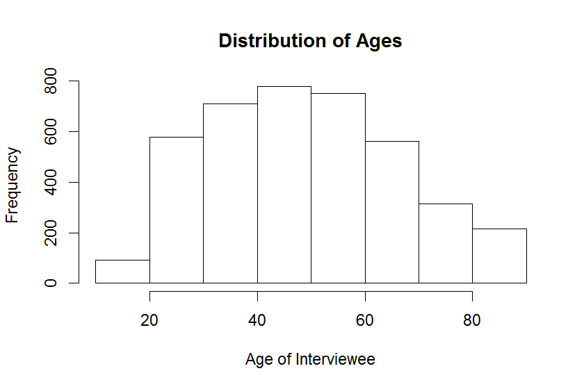

```r
# Show a distribution of ages and healthcare cost
ggplot(data = healthcare.data, mapping = aes(x = age.interviewee, y = healthcare)) + 
  geom_point() + 
  labs(title = "Healthcare Spending by Age", y = "Healthcare Spending", x = "Age") + 
  theme(plot.title = element_text(hjust = 0.5))
```

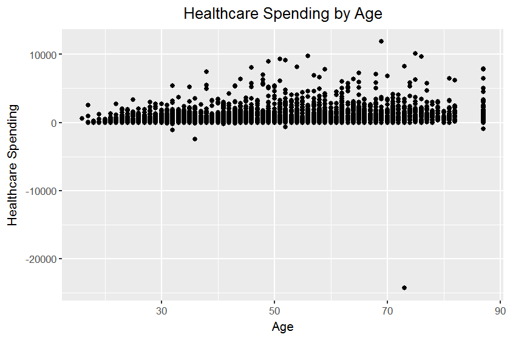
It is odd that the number of people over 80 (the rightmost stacked column) is so large. Perhaps these are top-coded values, or otherwise binned in a way that would cause this spike. There is a small amount of those less than age 20, as we can safely assume parents are paying for their children under age 18. The data is otherwise normally distributed. We will also notice that there are some people that are spending a negative amount on healthcare

It is also interesting to note the negative y intercept in the full dataset, that then becomes large and positive when subsetting.


```r
# Remove households who did not spend a positive amount or age is not 87.
# I'm assuming that 87 is the max value, based on the text above, which reads 87, not > 87.
healthcare.data.subsetted <- subset(healthcare.data, age.interviewee != 87 & healthcare > 0 )

# Fit a linear model
healthcare.model.subsetted = lm(healthcare ~ age.interviewee, data = healthcare.data.subsetted)

# Show the model
lm(healthcare.model.subsetted)
```

```
## 
## Call:
## lm(formula = healthcare.model.subsetted)
## 
## Coefficients:
##     (Intercept)  age.interviewee  
##          246.51            14.55
```

```r
# Plot the age distribution
hist(healthcare.data.subsetted$age.interviewee, breaks = 10, main = "Distribution of Ages (subsetted)", xlab = "Age of Interviewee")
```

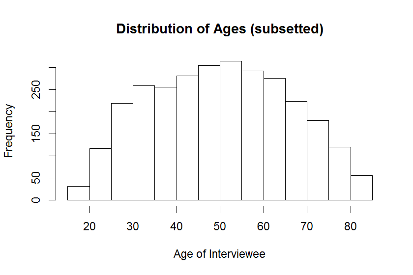

```r
# Show a distribution of ages and healthcare cost
ggplot(data = healthcare.data.subsetted, mapping = aes(x = age.interviewee, y = healthcare)) + 
  geom_point() + 
  labs(title = "Healthcare Spending by Age (Subsetted)", y = "Healthcare Spending", x = "Age") + 
  theme(plot.title = element_text(hjust = 0.5))
```

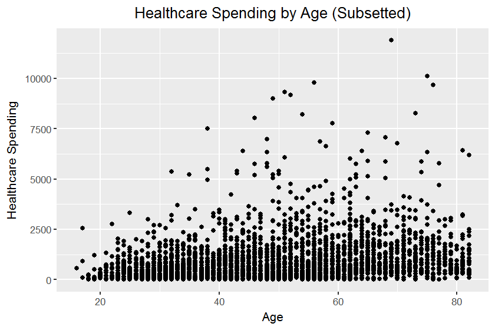

**Problem 1b:**

Plot a log transform of `healthcare` against `age.interviewee`. Do you notice anything unusual about the distribution? Specifically, is there an abrupt change in the distribution of expenditures at any particular age?

```r
# Fit a linear model using a log transform
# We will use the subsetted data, so that we can take the log of healthcare without worrying about zero values
healthcare.model.subsetted.log = lm(log(healthcare) ~ age.interviewee, data = healthcare.data.subsetted)

# Show the model
lm(healthcare.model.subsetted.log)
```

```
## 
## Call:
## lm(formula = healthcare.model.subsetted.log)
## 
## Coefficients:
##     (Intercept)  age.interviewee  
##         5.33663          0.01937
```

```r
# Show a distribution of ages and healthcare cost
ggplot(data = healthcare.data.subsetted, mapping = aes(x = age.interviewee, y = log(healthcare))) + 
      geom_point() +
      labs(title = "log(Healthcare Spending) by Age", y = "log(Healthcare Spending)", x = "Age") + 
      theme(plot.title = element_text(hjust = 0.5))
```

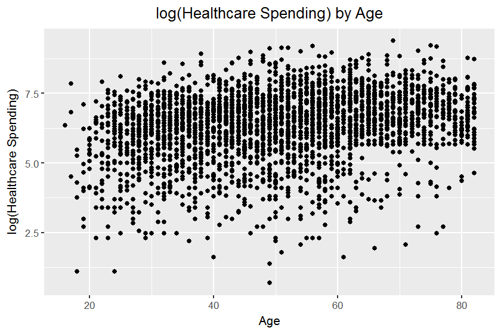

You should notice that around age 64 and up, there is an abrupt change; above this age, almost all of the households have a `log(healthcare)` above 5.3 or so. Let's just try to model the expenditures of those households where `age.interviewee` is 63 or less. Create this subset.


```r
# Create subset of those under 63 that pay for healthcare
nonelderly.households <- subset(healthcare.data, age.interviewee <= 63 & healthcare > 0)


####
#
# It's unclear if we want to build the model yet, so I will just leave this commented out
#
# Generate model
#nonelderly.model = lm(healthcare ~ age.interviewee, data = nonelderly.households)

# Show the model
#lm(nonelderly.model)

# Generate model with log transform
#nonelderly.model.log = lm(log(healthcare) ~ age.interviewee, data = nonelderly.households)

# Show the model
#lm(nonelderly.model.log)
```

**Problem 2:**

Choose a log or power transform, and use cross validation to fit a natural spline to your data. Plot the predictions to ensure they are well behaved. Make a s-l plot to check if the variance of the residuals is roughly constant as a function of the predicted values. If you are not satisfied with the results of the s-l plot, choose a new transform and repeat until you are satisfied. Your code should only reflect your final choice of transform.


```r
# Apply a power transform to the data, settling on 1/8 after trial and error
nonelderly.households$healthcare <- (nonelderly.households$healthcare)^(1/8)

# Call the function defined above to select a value for DF and fit a natural spline 
glm.cv.loop(nonelderly.households, "healthcare ~ ns(age.interviewee, df = DF)", seq (1, 10, by = 1))
```

```
## $scores
##  [1] 0.1026713 0.1022209 0.1023423 0.1022029 0.1024536 0.1024977 0.1023950
##  [8] 0.1024271 0.1025962 0.1027084
## 
## $plot
```

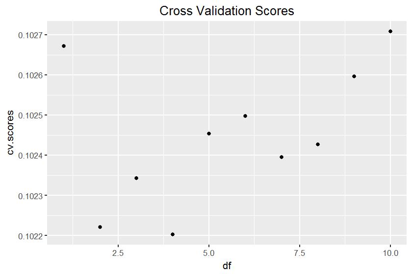

```r
# Select df value and build model (either 2 or 4)
nonelderly.model <- glm(healthcare ~ ns(age.interviewee, df = 2), data = nonelderly.households)

# Plot predictions with a spline fit
ggplot(data = nonelderly.households, mapping = aes(x = age.interviewee, y = healthcare)) + 
      geom_point() +
      labs( y = "(Healthcare Spending)^1/8", x = "Age") + 
      theme(plot.title = element_text(hjust = 0.5)) +
      geom_smooth(method = 'glm', formula = y ~ ns(x, df = 2)) + labs(title='Prediction with df = 2 \n Trend Line = healthcare ~ ns(age.interviewee, df = 2)')
```

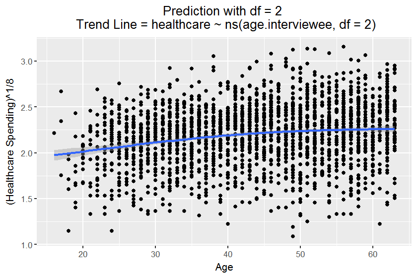

```r
# Make s-l plot
nonelderly.households <- mutate(nonelderly.households, pred = predict(nonelderly.model), resid = resid(nonelderly.model))
ggplot(data = nonelderly.households, mapping = aes(x = pred, y = sqrt(abs(resid)))) + 
  geom_point(size = 1) + 
  geom_smooth() +
  labs(title = "S-L Plot Transformed Data") + 
  theme(plot.title = element_text(hjust = 0.5)) 
```

```
## `geom_smooth()` using method = 'gam'
```

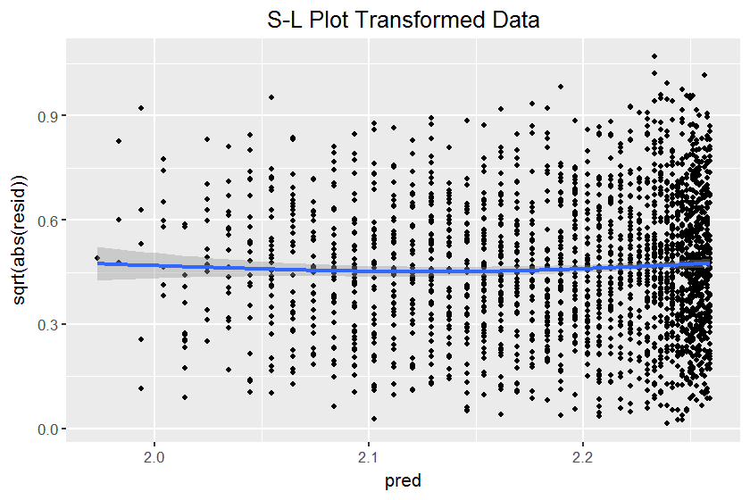

The S-L Plot is roughly a horizontal line, suggesting identical distribution.

**Problem 3:**

Plot the residuals against the predicted values to see if they look identically distributed. Divide `age.interviewee` and `.fitted` into groups, and use quantile plots or QQ plots to see if the residuals in each group look identically distributed. Do they?


```r
# Plot residuals against predicted value
healthcare.augmented <- augment(nonelderly.model, data = nonelderly.households)

ggplot(data = healthcare.augmented, mapping = aes(x = .resid, y = .fitted)) + 
  geom_point() +
  geom_smooth() +
  labs(x = 'Residuals', y = 'Predictions', title = 'Residuals vs. Predicted \n Healthcare Cost') + 
  theme(plot.title = element_text(hjust = 0.5))
```

```
## `geom_smooth()` using method = 'gam'
```

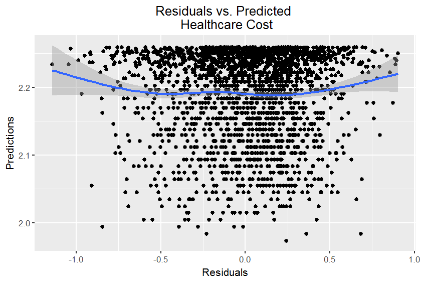

From this plot, it is not immediately obvious if the residuals are identically distributed. We can bin the ages into groups, and examine QQ Plots to see if a more clear pattern emerges.


```r
# Bin the data into 5 age groups
healthcare.augmented.bin <- healthcare.augmented
healthcare.augmented.bin$age.interviewee <- cut(healthcare.augmented.bin$age.interviewee, breaks = c(0, 25, 35, 45, 55, 99))

healthcare.augmented.bin <- mutate(healthcare.augmented.bin, actual.age = healthcare.augmented$age.interviewee)

# Generate QQ Plots for each bin
many.QQplots <- ddply(healthcare.augmented.bin, 'age.interviewee', Find.QQ, '.resid', y = healthcare.augmented.bin$.resid )

ggplot(data = many.QQplots, mapping = aes(x = q1, y = q2)) + geom_point() + facet_wrap('age.interviewee', nrow = 2) + 
  labs(x = 'All Residuals', y = 'Group Residuals', title = 'QQ plots \n Age Group Residuals vs. All Residuals') + 
  geom_abline(slope = 1) +
  theme(plot.title = element_text(hjust = 0.5)) 
```

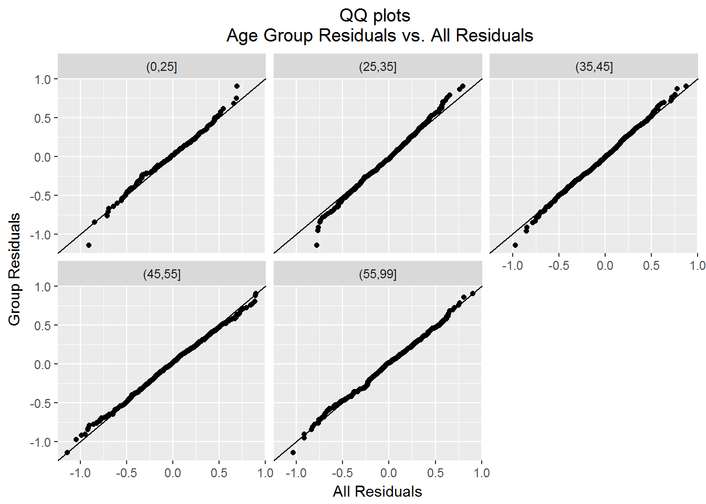

ANS: 

The residuals look identically distributed for most of the points in the age groups, as they seem to fall along the trendline. The only exceptions can be seen for the minimum values, which seem to peel slightly off of the line.

**Problem 4:**

Estimate the distribution of the residuals and use this estimate, plus the fitted trend, to estimate the probability distribution of `healthcare` as a function of `age.interviewee`. Create a plot showing some of the quantiles of this distribution as a function of `age.interviewee`. 

Were the assumptions of the model satisfied? Based on your checks of the assumptions, how might the predictions deviate from reality?


```r
nonelderly.quantiles <- Pool.Residuals(data.augment = healthcare.augmented, x = 'age.interviewee')

ggplot(data = nonelderly.quantiles, mapping = aes(x = age.interviewee, y = (value), color = variable)) + 
  geom_point(data = healthcare.augmented, mapping = aes(x = age.interviewee, y = healthcare), color = 'black', size = 1) + 
  geom_line(size=1) + 
  scale_color_brewer(palette = 'Set1', limits = c('q5', 'q4', 'q3', 'q2', 'q1'), labels = c('95%', '85%', '50%', '15%', '5%'))+   labs(title = "Estimate of Residual Distribution", x = 'Age Interviewee', y='Healthcare (Dollars)', color = 'Estimated \nQuantiles') +
  theme(plot.title = element_text(hjust = 0.5)) 
```

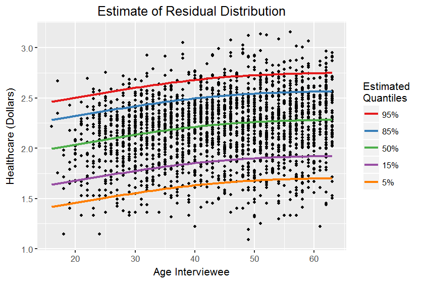

ANS:

Our assumption from the questions above was that the residuals were independently distributed. However, since there is a curvalinear pattern for each quantile, this plot indicates that there may be an issue with the spline fit. The residuals depend on age slightly, and our model doesn't completely explain or capture the variation in the original data. 

Our predictions could differ from reality in a number of trivial and nontrivial ways. Healthcare costs vary per person, per year, and may fail to capture the "average" person. 

**Problem 5:**

In part 1a, suppose we had kept the households who spent zero, instead of removing them. Is there any power transform that would work to make the residuals identically distributed? 

You may show a plot if it helps to explain your answer.


```r
# Apply a power transform to the data, settling on 1/8 after trial and error
healthcare.power.transform <- healthcare.data
healthcare.power.transform$healthcare <- (healthcare.power.transform$healthcare)^(1/8)


healthcare.power.transform.model <- glm(healthcare ~ age.interviewee, data = healthcare.power.transform)

#summary(healthcare.power.transform.model)
#plot(healthcare.power.transform.model$residuals)

healthcare.power.transform.augment<- augment(healthcare.power.transform.model, data = healthcare.power.transform)

ggplot(data = healthcare.power.transform.augment, mapping = aes(x = age.interviewee, y = .resid)) + 
  geom_point() +
  geom_smooth() +
  labs(x = 'Age', y = 'Residual', title = 'Residuals vs. Age') + 
  theme(plot.title = element_text(hjust = 0.5))
```

```
## `geom_smooth()` using method = 'gam'
```

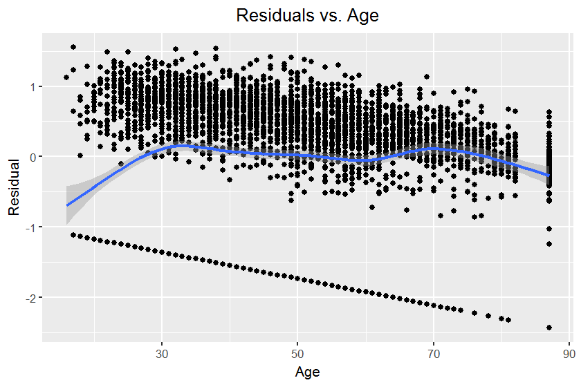

ANS:

A log transformation would not be defined for the zero values or negative values, but we would have been able to apply a power transform. As we know, zero raised to a power, even a fractional power, will still result in a transformed value of zero. We saw in problem 3 that some of the age groups were further away from the trend line in the first quantile (the left most values). Allowing zero values to be plotted would only further drag or skew the distribution of the data further away from the trend line, making the residuals less identically distributed. My initial thought is that no power transform will address this issue.

This is demonstrated slightly in the plot above, where the spline is noticeably pulled down with respect to the points, in almost an 'M' shape.  


